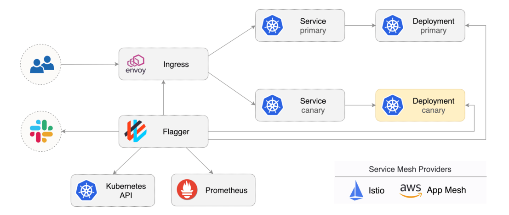

# Flagger

Continuous delivery is accepted as an enterprise software practice, and is a natural evolution of well-established
continuous integration principles. However continuous deployment continues to be notably rare,
perhaps due to the complexity of management and the fear of failed deployments impacting system availability.

Flagger is an open source Kubernetes operator that aims to untangle this complexity.
It automates the promotion of canary deployments by using 
Istio or App Mesh traffic shifting and Prometheus metrics to analyse the application's behaviour during a controlled rollout. 
The canary analysis can be extended with webhooks for running integration tests, load tests or any other custom validation.

Flagger implements a control loop that gradually shifts traffic to the canary while measuring key performance 
indicators like HTTP requests success rate, requests average duration and pods health. Based on the KPIs analysis 
a canary is promoted or aborted and the analysis result is published to Slack.

With Flagger you don't have to worry about keeping code and configuration changes in sync. Flagger keeps track of 
ConfigMaps and Secrets referenced by a Kubernetes Deployment and triggers a canary analysis if any of those objects change. 
When promoting a workload in production, both code (container images) and configuration (config maps and secrets) are 
being synchronised.

### Documentation

Flagger documentation can be found at [docs.flagger.app](https://docs.flagger.app)

* Install
    * [Flagger install on Kubernetes](https://docs.flagger.app/install/flagger-install-on-kubernetes)
    * [Flagger install on GKE Istio](https://docs.flagger.app/install/flagger-install-on-google-cloud)
    * [Flagger install on EKS App Mesh](https://docs.flagger.app/install/flagger-install-on-eks-appmesh)
* How it works
    * [Canary custom resource](https://docs.flagger.app/how-it-works#canary-custom-resource)
    * [Routing](https://docs.flagger.app/how-it-works#istio-routing)
    * [Canary deployment stages](https://docs.flagger.app/how-it-works#canary-deployment)
    * [Canary analysis](https://docs.flagger.app/how-it-works#canary-analysis)
    * [HTTP metrics](https://docs.flagger.app/how-it-works#http-metrics)
    * [Custom metrics](https://docs.flagger.app/how-it-works#custom-metrics)
    * [Webhooks](https://docs.flagger.app/how-it-works#webhooks)
    * [Load testing](https://docs.flagger.app/how-it-works#load-testing)
* Usage
    * [Istio canary deployments](https://docs.flagger.app/usage/progressive-delivery)
    * [Istio A/B testing](https://docs.flagger.app/usage/ab-testing)
    * [App Mesh canary deployments](https://docs.flagger.app/usage/appmesh-progressive-delivery)
    * [Monitoring](https://docs.flagger.app/usage/monitoring)
    * [Alerting](https://docs.flagger.app/usage/alerting)

This project is sponsored by [Weaveworks](https://www.weave.works/)
